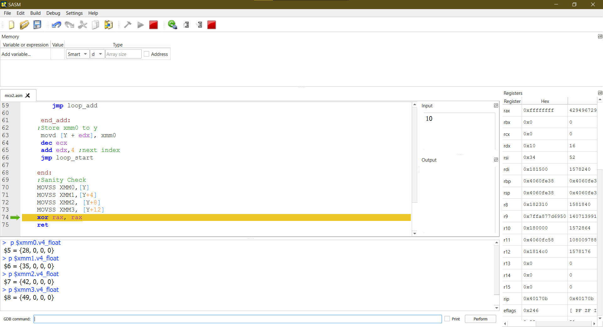
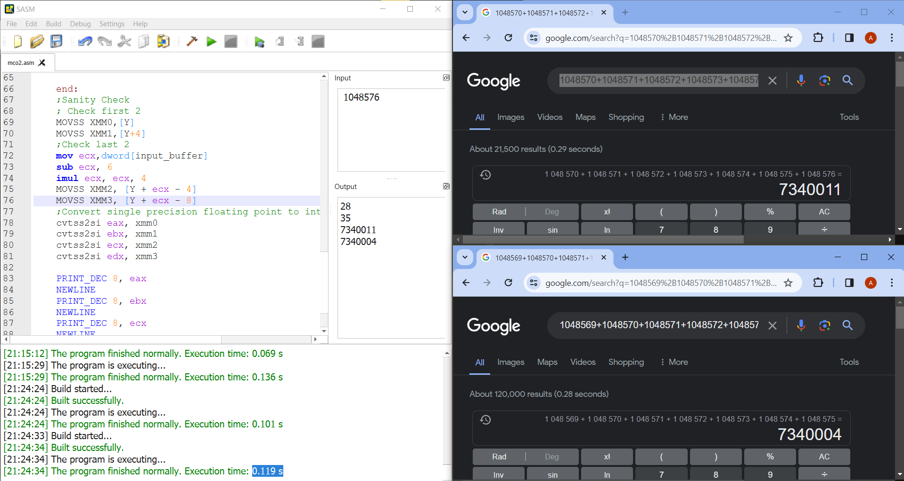
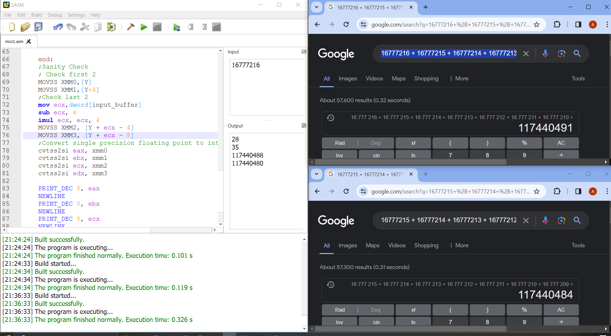
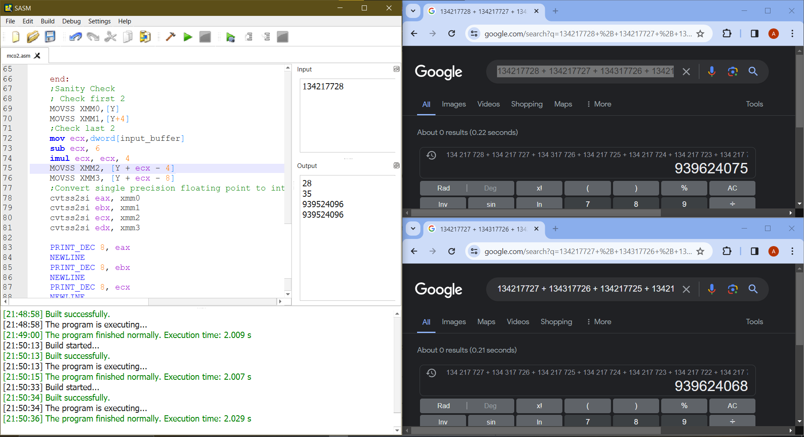

# lbyarch-mco2

## C++ PROGRAM 
### RUNTIME:

LENGTH OF ARRAY   |  RUNTIME (SECONDS)        |
|-----------------|---------------------------|
| 2 ^ 20          |  0.0189 s                 |
| 2 ^ 24          |  0.02485 s                |
| 2 ^ 30          |  21.9918 s                |

## x86-64 PROGRAM 
### RUNTIME
| LENGTH OF ARRAY | RUNTIME (SECONDS)         |
|-----------------|---------------------------|
| 2 ^ 20          | 0.051 s (Successful)      |
| 2 ^ 24          | 0.307 s (Successful)      |
| 2 ^ 27          | 2.09 s (Successful)        |
| 2 ^ 28          | Program crashed at 10.076 s|
| 2 ^ 29          | Program crashed at 8.053 s |
| 2 ^ 30          | Program crashed at 8.745 s |
* Note that these runtimes were recorded before sanity checks. This was done to avoid additional runtime overhead spent on checking the results.

### ASM SANITY CHECK:

The picture above shows a sanity check for when the array length is = 10. As seen in the GDB console, the vector Array Y contains the floating point values: 28, 35, 42, and  49. These are correct if we follow the given process specifications which is:
Y[i] = X [i - 3] + X [i - 2] + X [i - 1] + X [ i ] + X [ i + 1 ] + X [i + 2] + X [ i +3 ]

For 2^20, 2^24 and 2^27, the program will print the first 2 Y outputs and the last 2 Y outputs. As seen in the picture, the output printed (as an integer for debugging purposes, but if the code is checked, the results of Y is stored as a single precision floaitng point).

The results for 2^20 re accurate, as confirmed by our sanity check. However, the same level of accuracy cannot be guaranteed for the subsequent tests conducted for 2^24 and 2^27.

We suspect that the data inconsistency can be caused by the conversion of floating point to integer for the sake of showing our sanity checks for larger inputs. Another perspective into this issue is that the algorithm that we have implemented may have trouble keeping up wth the sheer amount of numbers to be processed. 

